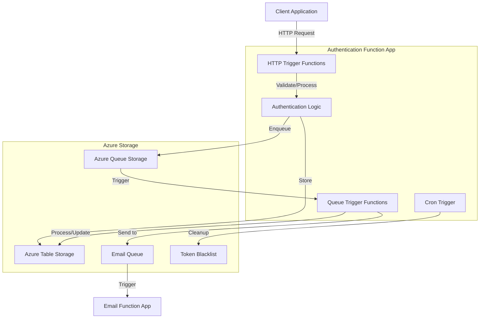
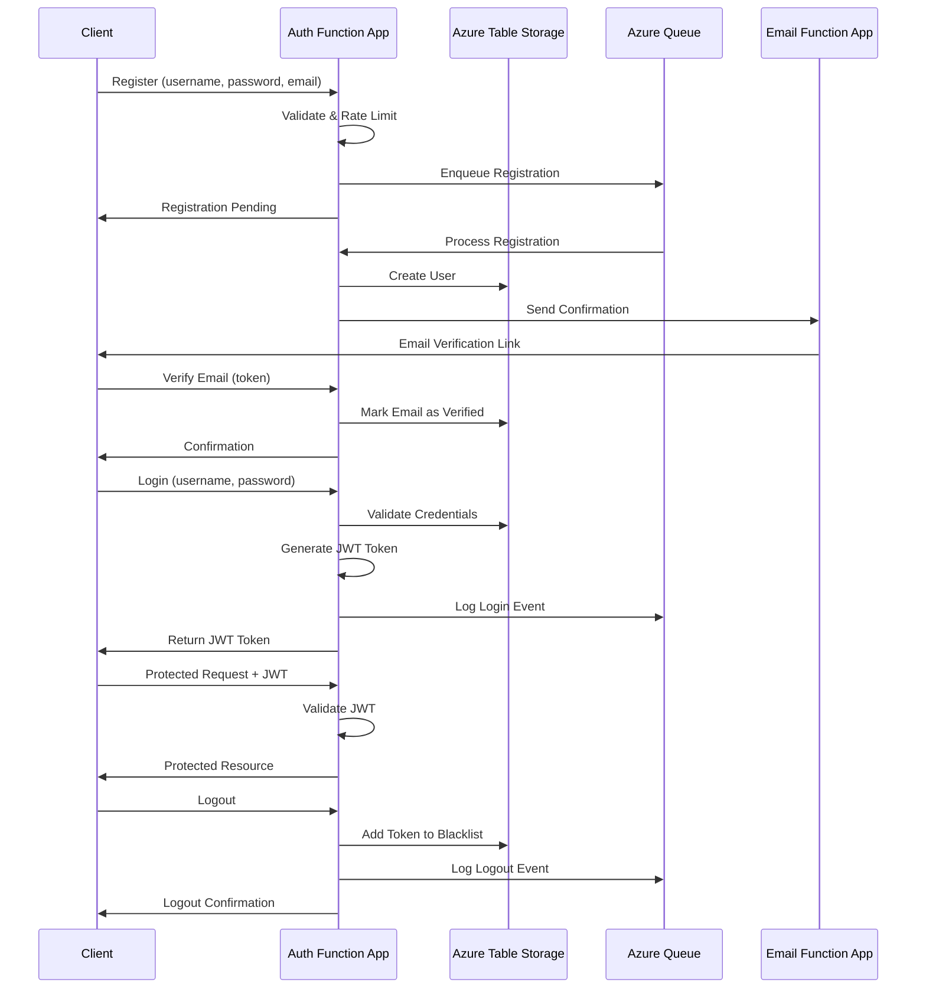

# Authentication Function App Architecture

This document outlines the architecture of the Authentication Function App.

## System Architecture



## Component Flow

### Authentication Process
1. Client sends credentials to HTTP trigger function
2. System validates credentials against stored user data
3. If valid, a JWT token is generated and returned
4. User activity is logged in queue for async processing
5. Email notification is sent via Email Function App

### Data Storage Model
- **Users Table**: Stores user profiles and credentials
- **Blacklist Table**: Manages invalidated tokens
- **Action Queue**: Processes user events asynchronously
- **Email Queue**: Sends notifications to external email function app

### Key Components

#### HTTP Trigger Functions
- `register`: User registration with email validation
- `login`: Authenticates users and issues JWT tokens
- `logout`: Invalidates active tokens
- `get_user`/`get_all_users`: Retrieves user information
- `delete_user`: Marks accounts as deleted
- `verify_email`: Confirms user email addresses
- `forgot_password`: Initiates password reset process
- `change_password`: Updates user passwords
- `resend_confirmation_token`: Resends verification emails

#### Queue Trigger Functions
- Process user registrations
- Update user information
- Handle token invalidation
- Log user activity

#### Timer Trigger Functions
- `cleanup_expired_tokens`: Daily job to remove expired tokens from blacklist

#### Authentication Guard
- JWT token validation
- IP address validation
- Email confirmation verification
- Token blacklist checking

#### Rate Limiting
- In-memory tracking of request frequency
- Separate limits for username/email and IP address
- Configurable thresholds for request volume

## Security Considerations
- Passwords are hashed before storage
- JWT tokens have configurable expiration
- Rate limiting prevents brute force attacks
- IP validation prevents unauthorized access from new locations
- Blacklisted tokens prevent replay attacks
- Email verification required for sensitive operations
```

## Data Flow Diagram

