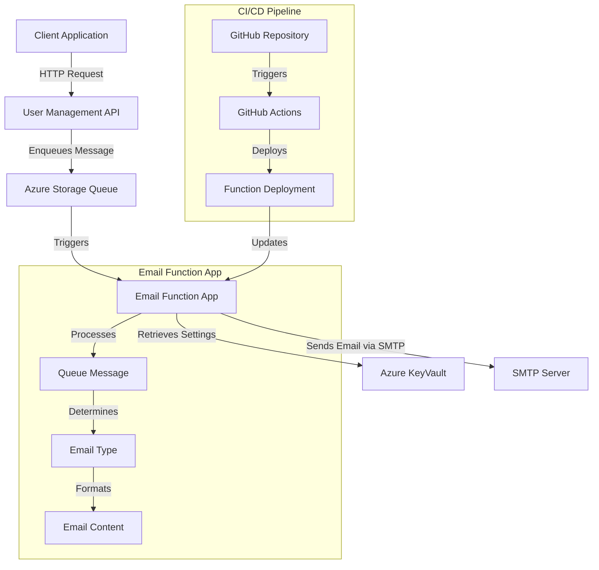

# Email Function App Architecture

This document describes the architecture and workflow of the Email Function App.

## System Architecture



## Data Flow

1. A user action (signup, login, etc.) triggers the client application to send a request to the User Management API.
2. The API processes the request and enqueues a message in the Azure Storage Queue.
3. The queue message contains the necessary data to generate an email (user details, action type, etc.).
4. The Email Function App is triggered by the new message in the queue.
5. The function processes the message, determines the email type, and formats the appropriate email content.
6. The function retrieves SMTP settings from environment variables (potentially stored in Azure KeyVault).
7. The function sends the email to the user via the SMTP server.
8. Logs are generated for monitoring and troubleshooting.

## Email Types and Templates

The Email Function App supports multiple email types:

- User Registration (signup)
- Login Notification
- Logout Notification
- Account Deletion Confirmation
- Password Reset Request
- Password Change Confirmation
- Email Verification
- General User Notifications

Each email type has a dedicated function that formats the content appropriately based on the data provided in the queue message.

## Security Considerations

- SMTP credentials are stored securely as environment variables
- Integration with Azure KeyVault for sensitive configuration
- TLS encryption for SMTP communication
- Input validation for email parameters
```